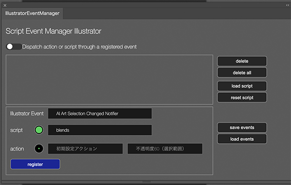

# IllustratorEventManager

[japanese explanation is here](https://kawano-shuji.com/justdiary/2022/03/08/illustrator-extenion-illustratoreventmanager/)

I developed Extension to managemnt event on Illustrator like Photoshop script event manager.
I refered to Photoshop event manager. so this is similar with it.
but Illustrator doen't have event system like Photoshop.
so I use AIHostAdapter plugin. [you can get plugin from here](https://github.com/Adobe-CEP/CEP-Resources/tree/master/CEP_11.x/AIHostAdapter) and developed panel.

## How install it

first you need AIHostAdapter plugin.
if you don't have, get it and put it in plugin folder

on Mac OS directory is like this
application -> Illustrator folder -> plugin

in case of Windows
PC->ProgramFiles->Adobe->Illustrator->plugin

and install this Extension zxp or clone git.

## How to use it

it almost same with Photoshop script event manager.
select event , and action or script , and register it.
switch the dispatch button , it watches your activity and detective event you chose.

1. **preset**
you can save preset you registered. and you can load it later.

2. **events**
plugin has tons of events. but actually I don't grasp all of events. but you can see how each event work [here](https://gist.github.com/tokyosheep/b5d6aa71821138c2d788258e0758c821)

as I said still I don't grasp all of events so before use it , so I definitely recommend to test before use for your actual work.
I can't guarantee stable condition on the Extension.

### download Extension

[download zxp file here](https://kawano-shuji.com/strage/IllustratorEventManager_0_9.zxp)

### about more AIHostAdapter plugin 

Adobe distributes this plugin.
but I'm not sure how long Adobe supports this plugin.
and this Extension works based on the plugin.
if Adobe stop to support this plugin . it won't work and I need alternative method.